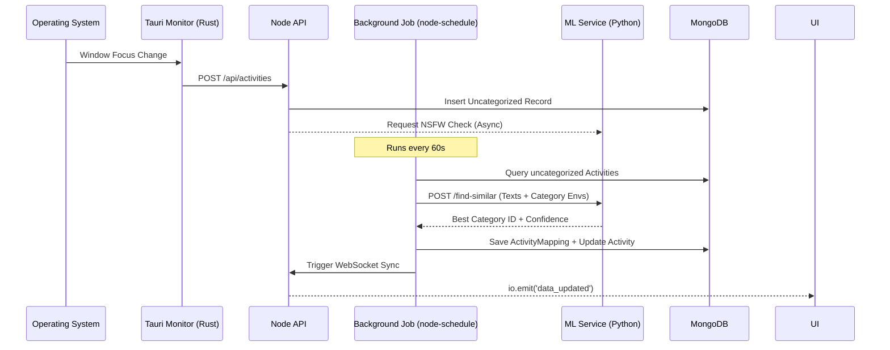
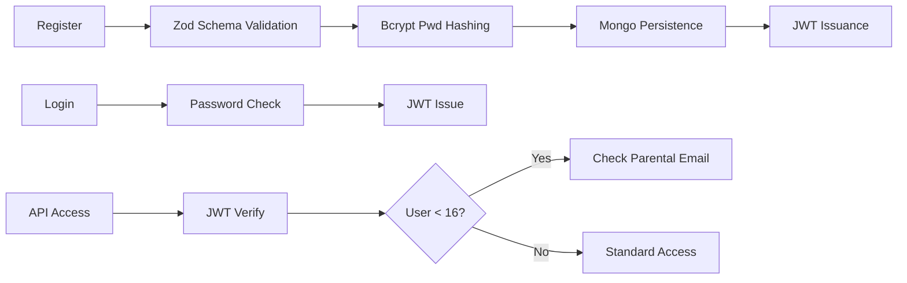

# 🎯 FocusBoard: Enterprise Productivity Intelligence

FocusBoard is an ultra-high-fidelity productivity suite engineered for deep-work analysis, team alignment, and automated activity intelligence. It integrates a native **Rust monitoring engine**, a scalable **Node.js/Bun backend**, and a **Python-driven NLP pipeline** to transform raw interaction data into high-granularity business insights.

---

## 📑 Table of Contents

- [1. Technical Philosophy](#1-technical-philosophy)
- [2. System Architecture V3](#2-system-architecture-v3)
  - [2.1 Activity Lifecycle Flow](#21-activity-lifecycle-flow)
  - [2.2 Authentication & Compliance Flow](#22-authentication--compliance-flow)
- [3. Core Module Specifications](#3-core-module-specifications)
  - [3.1 Native Telemetry (Rust/Tauri)](#31-native-telemetry-rusttauri)
  - [3.2 Semantic Categorization Engine (NLP)](#32-semantic-categorization-engine-nlp)
  - [3.3 Rule Engine (Priority Resolution)](#33-rule-engine-priority-resolution)
- [4. Data Architecture (High-Fidelity)](#4-data-architecture-high-fidelity)
  - [4.1 Core Domain Models](#41-core-domain-models)
  - [4.2 Management & Support Models](#42-management--support-models)
- [5. Full API Reference (v1.0.0)](#5-full-api-reference-v100)
- [6. Deployment & Devops](#6-deployment--devops)
  - [6.1 Infrastructure Orchestration](#61-infrastructure-orchestration)
  - [6.2 CI/CD Pipeline Analysis](#62-cicd-pipeline-analysis)
- [7. Security & Resilience Posture](#7-security--resilience-posture)
- [8. Development Guide](#8-development-guide)

---

## 1. Technical Philosophy

FocusBoard is built on the principle of **Passive Data Collection, Active Intelligence**. It minimizes user friction by automating the tracking-to-categorization pipeline while providing rigorous oversight mechanisms for privacy and safety.

**Key Technical Attributes:**
- **Zero-Polling Native Capture**: Utilizes Rust's system listeners to detect window changes instantly without high CPU cycles.
- **Contextual Expansion**: The ML service doesn't just match keywords; it expands window titles with "HINTS" (e.g., "VSCode" -> "development programming coding") to improve embedding match rates.
- **Distributed Intelligence**: Heavy transformer-based compute is isolated in the `ml-service` to ensure the API layer remains responsive.

---

## 2. System Architecture V3

### 2.1 Activity Lifecycle Flow
This diagram illustrates the journey of a single activity event from hardware capture to analytical representation.



### 2.2 Authentication & Compliance Flow
FocusBoard implements a strictly validated auth lifecycle with integrated safety checks for younger users.



---

## 3. Core Module Specifications

### 3.1 Native Telemetry (Rust/Tauri)
The native bridge in `src-tauri` is the source of truth for all activity.
- **Tauri Event**: `activity-update`.
- **Payload Schema**:
  ```json
  {
    "app_name": "string",
    "window_title": "string",
    "url": "string (browser mode only)",
    "idle_time": "number (ms)",
    "timestamp": "ISO8601"
  }
  ```
- **Fallback**: Browser-based tracking via `document.hasFocus()` and title polling when running in non-Tauri environments.

### 3.2 Semantic Categorization Engine (NLP)
Powered by the `ml-service` (FastAPI), the system performs vector similarity searches.
- **Model**: `all-MiniLM-L6-v2` (384-dimensional embeddings).
- **Thresholding**: Default `0.3` (configurable via `MIN_SIMILARITY_THRESHOLD`).
- **Context Expansion**: Titles are augmented with app-specific hints (e.g., mapping `Chrome` to `web browsing internet`) before vectorization.

### 3.3 Rule Engine (Priority Resolution)
The `categorizationService.js` handles explicit user overrides.
- **Algorithm**: Wildcard-to-Regex conversion.
- **Resolution**:
  1.  **Rule Match** (Highest Priority): Direct hit on `app_name`, `url`, or `window_title` patterns.
  2.  **ML Match**: Secondary fallback if no explicit rules match.
  3.  **Manual Override**: Permanent override if a user manually re-categorizes an item.

---

## 4. Data Architecture (High-Fidelity)

### 4.1 Core Domain Models

#### `Activity`
| Field | Type | Default | Note |
| --- | --- | --- | --- |
| `app_name` | String | Required | Executable name (e.g., Chrome) |
| `window_title`| String | `""` | Captured UI title |
| `start_time` | Date | Required | |
| `category_id` | String | null | Ref to `Category` |
| `idle` | Number | `0` | Seconds of inactivity |
| `nsfw_flagged`| Boolean| `false` | Triggered by ML service |

#### `ActivityMapping`
| Field | Type | Default | Note |
| --- | --- | --- | --- |
| `activityId` | String | Required | Ref link to `Activity` |
| `categoryId` | String | Required | Semantic target |
| `isManualOverride`| Boolean| `false` | User-driven change |
| `confidenceScore`| Number | `0` | ML matching probability |

#### `Category`
| Field | Type | Default | Note |
| --- | --- | --- | --- |
| `name` | String | Required | Semantic label |
| `productivityScore`| Number| `0` | -5 (Distraction) to +5 (Deep Work) |
| `color` | String | `bg-blue-500`| Tailwind-style class |
| `embedding` | [Number] | `[]` | 384-dimensional vector |

#### `Goal`
| Field | Type | Default | Note |
| --- | --- | --- | --- |
| `title` | String | Required | |
| `target_deep_work` | Number | Required | Minutes target |
| `distraction_limit`| Number | Required | Minutes cap |
| `achieved` | Boolean | `false` | Daily objective status |

#### `Integration`
| Field | Type | Default | Note |
| --- | --- | --- | --- |
| `name` | String | Required | e.g., 'GitHub', 'Google Cal' |
| `category` | String | Required | Integration vertical |
| `connected` | Boolean | `false` | Auth status |
| `syncStatus` | String | `Pending` | Synced, Syncing, Error, Pending |

#### `Task`
| Field | Type | Default | Note |
| --- | --- | --- | --- |
| `title` | String | Required | |
| `status` | String | `TODO` | TODO, IN_PROGRESS, DONE |
| `priority` | String | `MEDIUM` | HIGH, MEDIUM, LOW |
| `timeSpent` | Number | `0` | Accumulated ms |

#### `User`
| Field | Type | Default | Note |
| --- | --- | --- | --- |
| `email_id` | String | Required | Unique Index |
| `password` | String | Required | Bcrypt Hashed |
| `age` | Number | | Used for NSFW logic |
| `role` | String | `Member` | |
| `status` | String | `OFFLINE` | Enum: FOCUS, BREAK, etc. |

#### `TrackingRule`
| Field | Type | Default | Note |
| --- | --- | --- | --- |
| `pattern` | String | Required | Regex/Wildcard pattern |
| `matchType` | String | Required | app_name, url, window_title |
| `priority` | Number | `50` | Higher = Matches first |
| `categoryId` | String | Required | Target category link |

#### `SupportTicket`
| Field | Type | Default | Note |
| --- | --- | --- | --- |
| `subject` | String | Required | |
| `priority` | String | `Medium` | Low, Medium, High, Critical |
| `status` | String | `Open` | Open, In Progress, Resolved, Closed |
| `deviceInfo` | String | `""` | Captured client context |

### 4.2 Management & Support Models
The system integrates full CRM and Project Management capabilities.
- **`Project`**: Tracks `progress` (0-100) and `due_date`.
- **`Task`**: Granular tracking with `status` (TODO, IN_PROGRESS, DONE) and `priority`.
- **`Client`**: CRM entity for billable tracking with `hourlyRate`.
- **`SupportTicket`**: Incident management with `deviceInfo` capture and log-sharing consent.

---

## 5. Environment Configuration

FocusBoard uses a centralized configuration matrix in `FocusBoard-backend/config/index.js`.

| Variable | Default Value | Purpose |
| --- | --- | --- |
| `PORT` | `5000` | API Listener port |
| `MONGODB_URL` | `null` | Primary persistence URI |
| `JWT_SECRET` | `focusboard_dev_secret_change_me` | Session signature key |
| `ML_SERVICE_URL` | `http://localhost:5001` | NLP Gateway address |
| `DEFAULT_ACTIVITY_COLOR` | `#3B82F6` | Activity chart fallback color |
| `RATE_LIMIT_MAX` | `1500` (prod) / `5000` (dev) | Request throttling ceiling |
| `ALLOWED_ORIGINS` | `localhost:5173, etc.` | CORS Whitelist |

---

## 6. Full API Reference (v1.0.0)

Base URL: `http://localhost:5000/api`

| Group | Method | Endpoint | Description |
| --- | --- | --- | --- |
| **Auth** | `POST` | `/auth/register` | User instantiation |
| | `POST` | `/auth/login` | JWT Grant |
| | `GET` | `/auth/me` | Context retrieval |
| | `POST` | `/auth/dev-login` | Offline-first bypass (restricted) |
| **Activity**| `POST` | `/activities` | Single event ingest |
| | `POST` | `/activities/batch`| High-throughput ingest (max 50) |
| | `GET` | `/activities/recent`| Latest 15 logs |
| | `GET` | `/activities/export`| CSV/JSON data retrieval |
| **Metrics** | `GET` | `/metrics/dashboard`| Focus Score / Deep Work stats |
| | `GET` | `/metrics/timeline` | Granular hourly breakdown |
| | `GET` | `/metrics/summary` | Aggregated report |
| **Project** | `GET` | `/projects` | Project overview |
| | `POST`| `/projects` | New project instantiation |

---

## 6. Deployment & Devops

### 6.1 Infrastructure Orchestration
The project is containerized via `docker-compose.yml`.

| Service | Image | Exposed Port | Healthcheck |
| --- | --- | --- | --- |
| `backend` | Node:20 (Custom) | `5000` | `curl /health` |
| `ml-service`| Python (Custom) | `5001` | `curl /health` |
| `mongo` | Mongo:7 | `27017` | `mongosh ping` |

### 6.2 CI/CD Pipeline Analysis
GitHub Actions (`main.yml`) orchestrates a 10-phase pipeline:
1.  **Environment Setup**: Node 20 + Rust Stable.
2.  **Dep Installation**: Parallel `npm ci` for multiple directories.
3.  **Build Phase**: React/Vite builds.
4.  **Health-Wait Cycle**: Waits 120s for Docker health checks.
5.  **Seeding**: Initializes demo data via `seedStudentDay.js`.
6.  **E2E Testing**: `Cypress` execution against live dev server.
7.  **Unit Strategy**: `Jest` (Backend) + `Vitest` (Frontend) + `Pytest` (ML).
8.  **Tauri Compilation**: Native builds for linux/windows/macos.

---

## 7. Security & Resilience Posture

- **Layer 1: Runtime Context**: Uses `Bun` support for faster startup and native `.env` loading.
- **Layer 2: Validation**: All controller entrypoints use **Zod schemas** to prevent injection and type-poisoning.
- **Layer 3: Resilience**: Backend includes `MONGODB_URL` fallback and `RETRY_INTERVAL_MS` (10s) for database disconnection loops.
- **Layer 4: Rate Limiting**: Defaults to 1500 req/window in production to prevent telemetry spam.

---

## 8. Development Guide

### Contribution Workflow
1.  **Branching**: `feat/` (Features), `fix/` (Bugs), `ref/` (Refactoring).
2.  **Linting**: `npm run lint` (ESLint) + `ruff` (for Python).
3.  **Local Dev**: 
    - Start Mongo first.
    - `cd ml-service && uvicorn main:app`.
    - `cd FocusBoard-backend && bun server.js`.
    - `cd FocusBoard && bun dev`.

---

*FocusBoard Documentation V3.0 (Technical Update: 2024)*
