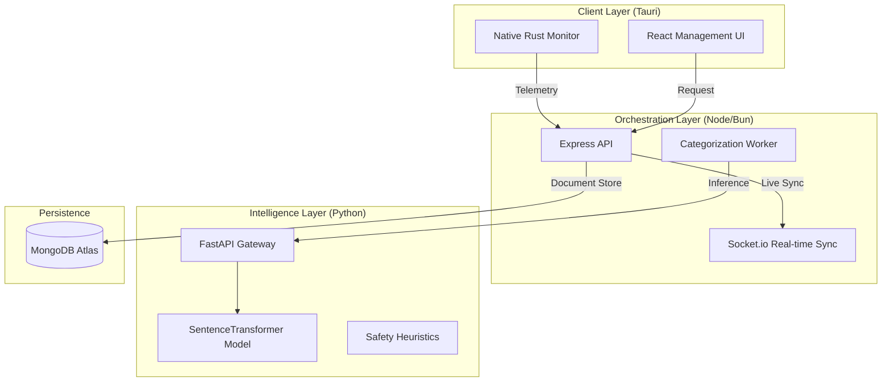

# 🎯 FocusBoard

[](https://opensource.org/licenses/MIT)
[](https://nodejs.org/)
[](https://bun.sh/)
[](https://reactjs.org/)
[](https://www.rust-lang.org/)
[](https://www.python.org/)
[](https://fastapi.tiangolo.com/)

FocusBoard is an enterprise-grade productivity intelligence suite engineered for deep-work analysis and team alignment. It orchestrates a native **Rust monitoring engine**, a **Node.js/Bun orchestration layer**, and a **Python-based Semantic Intelligence Layer** to transform digital activity into actionable insights.

---

## 📑 1. Project Overview

FocusBoard addresses the noise of modern work by providing automated, high-fidelity activity tracking. Unlike manual timers, FocusBoard captures every interaction at the OS level, using machine learning to semantically categorize activities without user intervention.

- **Objective**: Maximize "Deep Work" phases by identifying and mitigating distractions.
- **Scope**: Desktop-native monitoring with cloud-synced analytics and team management features.

---

## ✨ 2. Features

### 📡 High-Resolution Activity Tracking
- **Native OS Bridge**: Rust-powered window listeners capture transitions with sub-millisecond latency.
- **Contextual Ingestion**: Captures `app_name`, `window_title`, and `url` to build a complete digital footprint.

### 🤖 AI-Powered Semantic Categorization
- **Vector Embeddings**: Uses `all-MiniLM-L6-v2` to map activities to productivity categories based on semantic meaning.
- **Manual Overrides**: Sophisticated rule engine for custom regex/wildcard pattern matching.

### 🛡️ Safety & Compliance
- **NSFW Monitoring**: Proactive URL and title scanning for inappropriate content.
- **Parental Controls**: Integrated age-based enforcement and parental notification triggers.

### 📊 Performance Analytics
- **Focus Score**: Real-time calculation of productivity density.
- **Timeline Visualization**: Minute-by-minute breakdown of work phases vs. distractions.

---

## 🏛️ 3. System Architecture

FocusBoard utilizes a distributed architecture to isolate heavy compute from time-sensitive telemetry capture.



---

## 📂 4. Repository Structure

```text
.
├── FocusBoard/                 # Frontend (React + Vite + Tauri)
│   ├── src/                    # Management UI components
│   └── src-tauri/              # Native Rust monitoring logic
├── FocusBoard-backend/         # Central API (Node.js/Bun)
│   ├── controllers/            # Business logic handlers
│   ├── models/                 # Mongoose schemas (10+ models)
│   └── services/               # Background workers & rule engine
├── ml-service/                 # Intelligence Tier (Python/FastAPI)
│   ├── main.py                 # API Gateway
│   └── core.py                 # NLP & Safety logic
├── docs/                       # Architectural diagrams & specifications
└── docker-compose.yml          # Global orchestration
```

---

## 🛠️ 5. Technology Stack

### Core Runtime
- **Frontend**: React 18, TypeScript, TailwindCSS, Zustand.
- **Native Bridge**: Tauri (Rust).
- **Backend API**: Node.js / Bun (Runtime agnostic), Express.
- **Intelligence**: Python 3.9+, FastAPI.

### Infrastructure & ML
- **Database**: MongoDB (Mongoose ODM).
- **AI Model**: `sentence-transformers/all-MiniLM-L6-v2`.
- **Real-time**: Socket.io.
- **Validation**: Zod.

---

## 📥 6. Installation

### 1. Prerequisites
- **Node.js** v18+ or **Bun** v1.0+.
- **Python** 3.9+.
- **Rust** & **Cargo** (for Tauri builds).
- **MongoDB** instance.

### 2. Backend Setup
```bash
cd FocusBoard-backend
bun install
cp .env.example .env
```

### 3. ML Service Setup
```bash
cd ml-service
python -m venv venv
source venv/bin/activate
pip install -r requirements.txt
```

---

## 🚀 7. Running the System

### Standard Dev Workflow
1.  **Start ML Service**: `uvicorn main:app --port 5001 --reload`
2.  **Start Backend**: `bun run server.js`
3.  **Start Frontend**: `cd FocusBoard && bun tauri dev`

---

## ⚙️ 8. Environment Variables

### Backend (`.env`)
| Variable | Description | Default |
| --- | --- | --- |
| `PORT` | API Port | `5000` |
| `MONGODB_URL` | Persistence URI | Required |
| `JWT_SECRET` | Session Key | Required |
| `ML_SERVICE_URL`| Intelligence Endpoint | `http://localhost:5001` |

### ML Service
| Variable | Description | Default |
| --- | --- | --- |
| `MODEL_NAME` | Transformer Model | `all-MiniLM-L6-v2` |
| `MIN_SIMILARITY`| Match Threshold | `0.3` |

---

## 🔌 9. API Documentation

| Group | Method | Endpoint | Note |
| --- | --- | --- | --- |
| **Auth** | `POST` | `/api/auth/login` | Returns JWT |
| | `POST` | `/api/auth/register`| User instantiation |
| **Activities**| `POST` | `/api/activities` | Ingest (Zod Validated) |
| | `GET` | `/api/activities` | Paginated retrieval |
| **Metrics** | `GET` | `/api/metrics/dashboard`| Aggregate focus stats |
| | `GET` | `/api/metrics/timeline`| Time-block breakdown |

---

## 🗄️ 10. Database Design

### Core Schema Overview
- **`Activity`**: High-frequency telemetry log.
- **`Category`**: Vectorized intelligence targets.
- **`Mapping`**: Relational link between telemetry and AI classification.
- **`TrackingRule`**: High-priority user-defined regex overrides.

> [!NOTE]
> All models utilize a UUID-v4 primary key structure for distributed compatibility.

---

## 👨‍💻 11. Development Workflow

- **Branching**: All features must originate from `feat/` and require a PR.
- **Code Style**: ESLint (Tier 1) and Prettier enforced.
- **ML Testing**: New categories require re-embedding generation via `generate-embeddings.js`.

---

## 🧪 12. Testing

FocusBoard maintains a rigorous 4-tier testing strategy:
1.  **Unit (Jest)**: Core API logic and Mongoose hooks.
2.  **Frontend (Vitest)**: Component rendering and Zustand state.
3.  **E2E (Cypress)**: Full system flow from login to activity sync.
4.  **ML (Pytest)**: Accuracy verification for the transformer pipeline.

---

## 🚢 13. Deployment

### Containerization
FocusBoard is natively cloud-ready via the root `docker-compose.yml`.
```bash
docker-compose up --build -d
```

### CI/CD
GitHub Actions (`.github/workflows/main.yml`) automates build verification and native artifact compilation.

---

## 🔍 14. Debugging Guide

- **ML Failures**: Check `ml-service` logs for memory pressure (~1GB RAM required).
- **Socket Disconnects**: Ensure `ALLOWED_ORIGINS` in backend config allows the Tauri `tauri://localhost` protocol.
- **Tracking Issues**: Verify Rust permissions for window title capture on MacOS/Linux.

---

## 📈 15. Performance Considerations

- **Write Buffering**: Ingest endpoint supports batching to minimize DB IO Wait.
- **Scaling**: The `ml-service` is stateless; scale horizontally behind a load balancer for high-volume team tracking.

---

## 🔒 16. Security Considerations

- **Security Headers**: `Helmet` enforced across all routes.
- **Input Sanitization**: Total enforcement of Zod schemas for every incoming REST payload.
- **Stateless Auth**: JWT-only sessions with 7d revocation cycles.

---

## 🗓️ 17. Future Improvements

- [ ] **Cross-Platform Activity Export**: Native PDF productivity reports.
- [ ] **Deep Integration**: Google Calendar & Slack status sync.
- [ ] **On-Device ML**: Moving inference to the Rust layer for 100% offline privacy.

---

## 🤝 18. Contributing

Contributions are welcome!
1. Fork the repo.
2. Create your feature branch (`git checkout -b feature/AmazingFeature`).
3. Commit changes (`git commit -m 'Add AmazingFeature'`).
4. Push to the branch (`git push origin feature/AmazingFeature`).
5. Open a Pull Request.

---

## 📜 19. License

Distributed under the **MIT License**. See `LICENSE` for more information.

---

*Generated by FocusBoard Technical Documentation Team | 2024*
