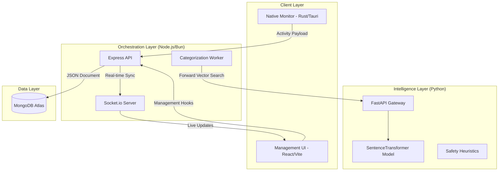

# 🎯 FocusBoard

[](https://opensource.org/licenses/MIT)
[](https://nodejs.org/)
[](https://bun.sh/)
[](https://reactjs.org/)
[](https://www.rust-lang.org/)
[](https://www.python.org/)
[](https://fastapi.tiangolo.com/)

FocusBoard is a production-grade, AI-powered productivity environment engineered for deep-work analysis and team alignment. It integrates a native **Rust monitoring engine**, a **Node.js/Bun orchestration layer**, and a **Python NLP service** to transform raw digital activity into actionable performance metrics.

---

## 📑 Table of Contents

- [1. Technical Overview](#1-technical-overview)
- [2. System Architecture](#2-system-architecture)
- [3. Core Technical Modules](#3-core-technical-modules)
  - [Native Monitoring Engine (Rust/Tauri)](#native-monitoring-engine-rusttauri)
  - [ML Classification Pipeline (Python/FastAPI)](#ml-classification-pipeline-pythonfastapi)
  - [Real-time Events (WebSockets)](#real-time-events-websockets)
- [4. Repository & Module Structure](#4-repository--module-structure)
- [5. Database Schema & Persistence](#5-database-schema--persistence)
- [6. Security & Validation Posture](#6-security--validation-posture)
- [7. Installation & Deployment](#7-installation--deployment)
  - [Bare Metal (Bun/Node)](#bare-metal-bunnode)
  - [Docker Orchestration](#docker-orchestration)
- [8. API Specification](#8-api-specification)
- [9. Testing Architecture](#9-testing-architecture)
- [10. Troubleshooting & Performance](#10-troubleshooting--performance)

---

## 1. Technical Overview

FocusBoard addresses the complexity of modern productivity tracking by automating the data lifecycle from capture to categorization. 

**Key Technical Differentiators:**
- **Hybrid Capture**: Native OS window tracking (Rust) combined with browser-level focus polling.
- **Semantic Engine**: Vector embedding-based activity mapping using `SentenceTransformers`.
- **Offline-First Resilience**: Backend-level database status monitoring with 503 fallback and auto-reconnection logic.
- **High-Granularity Backgrounding**: Sub-minute categorization jobs powered by `node-schedule`.

---

## 2. System Architecture

The system utilizes a distributed architecture to separate heavy ML compute from the real-time API layer.



---

## 3. Core Technical Modules

### Native Monitoring Engine (Rust/Tauri)
The `src-tauri` core interacts with OS-level APIs to capture window activity with minimal performance overhead.
- **Event Dispatch**: Emits `activity-update` events to the frontend bridge when a window focus change or title update is detected.
- **Payload Structure**: Captures `app_name`, `window_title`, `url` (via browser integration), and `idle_time`.

### ML Classification Pipeline (Python/FastAPI)
The `ml-service` provides the semantic "brain" of the project.
- **Model**: `all-MiniLM-L6-v2` (SentenceTransformer).
- **Classification**: Uses Cosine Similarity between activity text and category embeddings.
- **NSFW Heuristics**: Multi-stage detection combining domain blacklists (`NSFW_DOMAINS`) and keyword regex patterns (`NSFW_KEYWORDS`).
- **Optimization**: Numerical operations handled via `NumPy` for efficient batch cross-matching.

### Real-time Events (WebSockets)
- **Engine**: Socket.io integration across the stack.
- **Flow**: When the `Categorization Worker` updates an activity, a broad-cast is triggered to the UI, allowing for zero-refresh dashboard updates.

---

## 4. Repository & Module Structure

| Path | Purpose | Key Technologies |
| --- | --- | --- |
| `FocusBoard/` | Desktop/Web Client | React, TypeScript, Tauri, Zustand |
| `FocusBoard-backend/` | Central API Orchestrator | Node.js, Mongoose, Zod, Socket.io |
| `ml-service/` | NLP & Safety Engine | Python, FastAPI, Transformers |
| `docs/` | System Diagrams | Mermaid, Eraser.io |

---

## 5. Database Schema & Persistence

FocusBoard uses a high-performance Mongoose-based schema architecture.

| Collection | Role | Key Indexes |
| --- | --- | --- |
| `activities` | Raw activity logs | `user_id`, `start_time` |
| `categories` | User-defined buckets | `user_id`, `name` |
| `activitymappings` | ML Linkage records | `activityId`, `categoryId` |
| `trackingrules` | Pattern-based filters | `priority (desc)` |

---

## 6. Security & Validation Posture

Security is implemented at multiple layers to ensure production reliability:
- **Layer 1: Network Headers**: `Helmet` is used for CSP, XSS protection, and MIME sniffing prevention.
- **Layer 2: Schema Validation**: Every API request is strictly validated via **Zod schemas** (`middleware/validation.js`).
- **Layer 3: Authentication**: Stateless JWT implementation with custom `authMiddleware` and `requireAuth` logic.
- **Layer 4: Rate Limiting**: `express-rate-limit` prevents brute-force on auth routes and DoS on telemetry ingest.

---

## 7. Installation & Deployment

### Bare Metal (Bun/Node)

**Backend Environment:**
```bash
cd FocusBoard-backend
bun install # or npm install
cp .env.example .env
bun run server.js
```

**ML Service Environment:**
```bash
cd ml-service
python -m venv venv
source venv/bin/activate
pip install -r requirements.txt
uvicorn main:app --port 5001
```

### Docker Orchestration
For a unified environment, use the provided Docker Compose configuration:
```bash
docker-compose up --build -d
```

---

## 8. API Specification

| Method | Endpoint | Description | Validation |
| --- | --- | --- | --- |
| `POST` | `/api/auth/login` | Session Initialization | Email/Password (Zod) |
| `POST` | `/api/activities` | Ingest Telemetry | Activity Object |
| `GET` | `/api/metrics/dashboard` | Aggregated Performance | Auth Only |
| `POST` | `/api/auth/dev-login` | Bypass Auth (Dev Only) | Restricted to `!production` |

---

## 9. Testing Architecture

FocusBoard maintains a high coverage bar across services:
- **Unit (Backend)**: `Jest` (Mocked MongoDB/Services).
- **Unit (Frontend)**: `Vitest` + `React Testing Library`.
- **E2E**: `Cypress` for multi-service integration tests.
- **ML**: `Pytest` for classification accuracy verification.

---

## 10. Troubleshooting & Performance

### Scaling Strategy
- **Horizontal Scaling**: The `ml-service` is stateless and can be scaled independently behind a load balancer.
- **Write Optimization**: Activity ingestion supports batching (`/api/activities/batch`) to reduce DB connection overhead.

### Common Failure Modes
- **Category Drift**: If categorization confidence scores drop, ensure the `generate-embeddings` script is run after category modifications.
- **Memory Pressure**: The ML service requires ~1GB peak RSS for the transformer model.

---

## 🏁 Final Notes
FocusBoard is designed with extensibility in mind. For contribution guidelines, please see the `CONTRIBUTING.md` in the `docs` folder.
