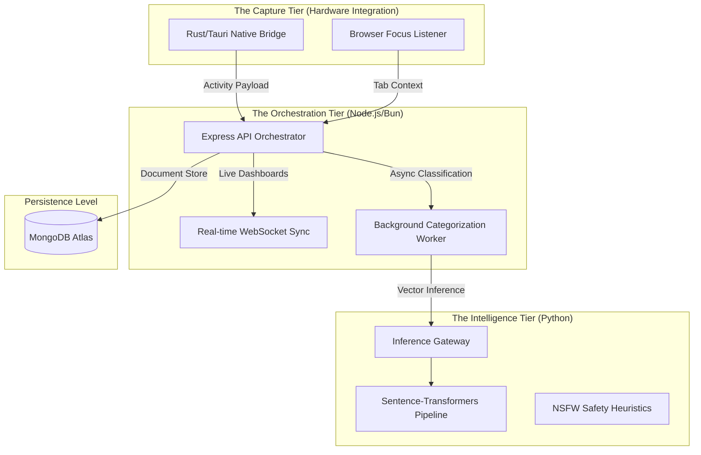

# 🎯 FocusBoard

[](https://opensource.org/licenses/MIT)
[](https://nodejs.org/)
[](https://bun.sh/)
[](https://reactjs.org/)
[](https://www.rust-lang.org/)
[](https://www.python.org/)
[](https://fastapi.tiangolo.com/)

FocusBoard is an enterprise-grade productivity intelligence environment designed for high-resolution activity analysis. By orchestrating a **Native Rust Telemetry Bridge**, a **Node.js/Bun Central API**, and a **Python-based Semantic Intelligence Layer**, FocusBoard transforms raw digital interactions into structured, actionable performance metrics.

---

## 🏛️ System Architecture & Data Flow

FocusBoard operates as a distributed system, separating low-level hardware events from high-level cognitive classification.



### The Native-to-Cloud Pipeline
FocusBoard's sophistication lies in its multi-stage data lifecycle:
1.  **Hardware Ingestion**: The Rust core in `src-tauri` intercepts OS-level focus events, capturing application paths and window metadata with sub-millisecond latency.
2.  **Orchestration**: The backend serves as a stateless traffic controller, handling JWT-secured ingestion and routing telemetry to the intelligence tier.
3.  **Semantic Inference**: Activities are mapped to internal vector spaces using `all-MiniLM-L6-v2`. This allows the system to understand that "vscode - activityController.js" belongs to "Software Development" without explicit user rules.

---

## 🧠 Core Intelligence Logic

### 1. Semantic State Engine
Unlike traditional keyword-based trackers, FocusBoard utilizes vector embeddings for high-accuracy categorization.
- **Confidence Thresholding**: Automatic mapping requires a cosine similarity $\geq 0.3$.
- **Activity Hints**: The `ml-service` expands minimal metadata (e.g., `Slack`) with semantic hints (`communication chat team messaging`) to increase the probability of a correct category match.

> [!NOTE]
> If categorization confidence falls below the threshold, the activity moves to a "Pending Review" state for user-assisted learning.

### 2. Native Monitoring Bridge
The Rust implementation in `src-tauri` ensures FocusBoard doesn't impact system performance.
- **Low Overhead**: Passive listeners replace intensive polling mechanisms.
- **Event Scope**: Captures `app_name`, `window_title`, `url` (via browser bridge), and automated `idle_time` calculation.

---

## 📂 Technical Data Model

The system utilizes a high-performance Mongoose-driven schema designed for high-write telemetry ingestion.

| Entity | Role | Key Attributes |
| --- | --- | --- |
| **`Activity`** | Raw Telemetry | `app_name`, `window_title`, `url`, `start_time`, `idle_ms`, `nsfw_flagged` |
| **`Category`** | Intelligence Targets | `name`, `productivityScore (-5 to +5)`, `embedding (Vector)`, `color` |
| **`Mapping`** | Semantic Linkage | `activityId`, `categoryId`, `confidenceScore`, `isManualOverride` |
| **`Rule`** | Explicit Overrides | `pattern (Regex/Wildcard)`, `matchType (URL/Window)`, `priority` |
| **`User`** | Auth & Compliance | `email_id`, `age (NSFW logic)`, `parentEmail`, `role (Permissions)` |

> [!IMPORTANT]
> **Parental Compliance Logic**: Users under the age of 16 are subject to the `NSFW_ALERT_FORCE` logic, which requires a valid `parentEmail` for activity ingest if safety filters are enabled.

---

## 🔌 API Ecosystem (v1.0.0)

Every endpoint is strictly enforced by **Zod-based validation** and stateless **JWT sessions**.

- **Authentication**: `POST /api/auth/login`, `POST /api/auth/register`, `POST /api/auth/dev-login`.
- **Telemetry Ingest**: `POST /api/activities` (Individual), `POST /api/activities/batch` (Max 50/req).
- **Intelligence Reports**: `GET /api/metrics/dashboard`, `GET /api/metrics/timeline`, `GET /api/metrics/trends`.
- **Management**: `POST /api/projects`, `POST /api/tasks`, `POST /api/clients`.

---

## 🚀 Production Readiness Checklist

FocusBoard is built with industrial-grade resilience features:
- [x] **Rate Limiting**: Throttling enabled on all public-facing routes via `express-rate-limit`.
- [x] **Safety Architecture**: Multi-stage NSFW detection (Domain Blacklists + Keyword Sharding).
- [x] **DB Fallback**: Integrated health-check middleware returning 503 on database disconnection.
- [x] **Stateless Scaling**: The ML service and Backend are fully containerized and horizontally scalable.
- [x] **Testing Maturity**: Integrated CI/CD pipeline covering Unit (Jest/Vitest), Integration, and E2E (Cypress).

---

## 🛠️ Development & Deployment

### Quick Start (Docker Orchestration)
The fastest way to experience the full stack is via Docker Compose:
```bash
docker-compose up --build -d
```

### Bare Metal Requirements
- **Runtime**: Bun 1.0+ or Node.js 18+.
- **Database**: MongoDB 6.0+.
- **Intelligence**: Python 3.9+ (Pip requirements in `ml-service/`).

---

*FocusBoard Technical Manual V4.0 | Engineered for Excellence*
