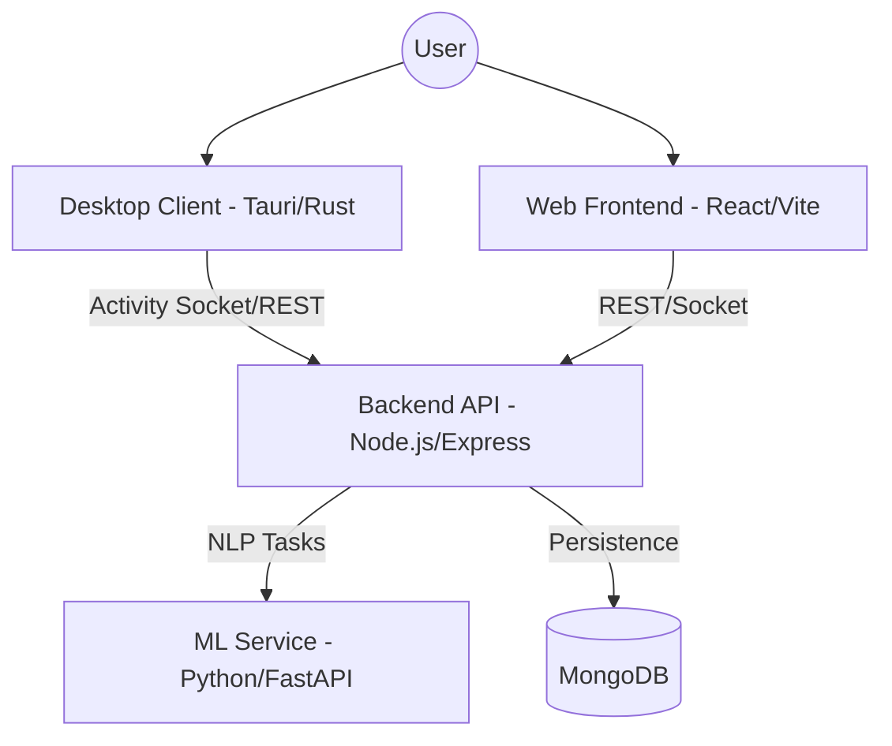

# FocusBoard

FocusBoard is a production-grade, AI-powered productivity suite designed for individuals and teams to track, categorize, and optimize their digital activities. Leveraging a desktop monitor, a scalable Node.js backend, and a specialized ML service, FocusBoard provides real-time insights into time allocation, goal progress, and team collaboration.

---

## Table of Contents

- [1. Project Overview](#1-project-overview)
- [2. Features](#2-features)
- [3. System Architecture](#3-system-architecture)
- [4. Repository Structure](#4-repository-structure)
- [5. Technology Stack](#5-technology-stack)
- [6. Installation](#6-installation)
- [7. Running the System](#7-running-the-system)
- [8. Environment Variables](#8-environment-variables)
- [9. API Documentation](#9-api-documentation)
- [10. Database Design](#10-database-design)
- [11. Development Workflow](#11-development-workflow)
- [12. Testing](#12-testing)
- [13. Deployment](#13-deployment)
- [14. Debugging Guide](#14-debugging-guide)
- [15. Performance Considerations](#15-performance-considerations)
- [16. Security Considerations](#16-security-considerations)
- [17. Future Improvements](#17-future-improvements)
- [18. Contributing](#18-contributing)
- [19. License](#19-license)

---

## 1. Project Overview

FocusBoard solves the problem of "invisible time" by automatically capturing and analyzing digital activities. Unlike manual time trackers, FocusBoard uses a native desktop monitor to sense active window titles and URLs, then uses NLP-based machine learning to categorize these activities into meaningful groups like "Development," "Communication," or "Entertainment."

The system is designed for:
- **Individual Developers**: To understand deep-work patterns.
- **Teams/Squads**: To visualize collective effort without manual logging.
- **Project Managers**: To align daily activities with high-level goals and leads.

---

## 2. Features

### 🕵️ Automatic Activity Tracking
- **Desktop Monitor**: A Tauri-powered desktop application (Rust) monitors system-level window changes and browser URLs.
- **Privacy First**: Tracking is local, and users can set up exclusion rules to prevent sensitive data from being captured.

### 🧠 AI-Powered Categorization
- **Semantic Mapping**: Uses `sentence-transformers` (all-MiniLM-L6-v2) to map activities to user-defined categories.
- **Background Jobs**: A scheduled task in the backend periodically processes uncategorized activities using the ML service.

### 🛡️ NSFW & Safety Monitoring
- **Real-time Detection**: The ML service checks URLs and window titles against known NSFW patterns and keyword lists.
- **Alert System**: Automatically flags inappropriate content based on user age and preferences, sending alerts to administrators or parents if configured.

### 📊 Advanced Analytics & Dashboards
- **Time Distribution**: Visualizes time spent across different categories and projects.
- **Goal Tracking**: Monitors progress against daily or project-based time goals.
- **Drill-down Views**: Allows users to inspect specific sessions and activities in detail.

### 👥 Team & Squad Collaboration
- **Shared Visualization**: View team-wide productivity metrics and squad goals.
- **Lead & Project Management**: Associate activities directly with client leads and project milestones.

### 🎫 Support & Feedback
- **Integrated Ticketing**: Built-in support ticket system for reporting issues or requesting features.
- **User Feedback**: Direct channel for providing feedback on the platform.

---

## 3. System Architecture

The FocusBoard architecture is designed for scalability and real-time responsiveness.



- **Client Layer**: The Tauri desktop app handles native monitoring, while the React web app provides the management interface.
- **API Layer**: Node.js backend acts as the orchestrator, managing authentication, business logic, and WebSocket communication.
- **Intelligence Layer**: A standalone Python service provides vector embeddings and semantic classification.
- **Data Layer**: MongoDB stores user profiles, activities, categories, and analytical reports.

---

## 4. Repository Structure

```text
.
├── FocusBoard/                 # Frontend (React + Vite + Tauri)
│   ├── src/                    # UI Components, Stores (Zustand), Services
│   ├── src-tauri/              # Rust-based Desktop Monitoring Core
│   └── public/                 # Static Assets
├── FocusBoard-backend/         # Backend API (Node.js + Express)
│   ├── controllers/            # Request handlers
│   ├── models/                 # Mongoose schemas
│   ├── routes/                 # API endpoint definitions
│   ├── services/               # Business logic & background jobs
│   └── utils/                  # Shared utilities (logger, etc.)
├── ml-service/                 # ML Engine (Python + FastAPI)
│   ├── main.py                 # API routes for embedding & NSFW detection
│   └── core.py                 # NLP models and classification logic
├── docs/                       # Architecture diagrams & documentation
└── docker-compose.yml          # Infrastructure orchestration
```

---

## 5. Technology Stack

- **Frontend**: [React](https://reactjs.org/), [Vite](https://vitejs.dev/), [MUI](https://mui.com/), [Framer Motion](https://www.framer.com/motion/).
- **Desktop**: [Tauri](https://tauri.app/) (Rust-based native bridge).
- **Backend**: [Node.js](https://nodejs.org/), [Express](https://expressjs.com/), [Bun](https://bun.sh/) (Runtime supported).
- **ML Service**: [Python](https://www.python.org/), [FastAPI](https://fastapi.tiangolo.com/), [Sentence-Transformers](https://www.sbert.net/), [NumPy](https://numpy.org/).
- **Database**: [MongoDB](https://www.mongodb.com/) (Atlas or local).
- **Infratructure**: [Docker](https://www.docker.com/), [GitHub Actions](https://github.com/features/actions).

---

## 6. Installation

### Prerequisites
- Node.js (>= 18.0.0) or Bun
- Python (>= 3.9)
- Docker & Docker Compose
- Rust (for Tauri desktop builds)

### Step-by-Step Setup

1. **Clone the repository**:
   ```bash
   git clone https://github.com/FocusBoard/FocusBoard.git
   cd FocusBoard
   ```

2. **Backend Setup**:
   ```bash
   cd FocusBoard-backend
   npm install
   cp .env.example .env # Configure your MONGO_URI and secrets
   ```

3. **ML Service Setup**:
   ```bash
   cd ../ml-service
   pip install -r requirements.txt
   ```

4. **Frontend Setup**:
   ```bash
   cd ../FocusBoard
   npm install
   ```

---

## 7. Running the System

### Docker Deployment (Recommended for Production)
```bash
docker compose up --build
```
This starts the Backend (port 5000), ML Service (port 5001), and MongoDB (port 27017).

### Local Development Mode

1. **Start ML Service**:
   ```bash
   cd ml-service
   uvicorn main:app --host 0.0.0.0 --port 5001
   ```

2. **Start Backend**:
   ```bash
   cd FocusBoard-backend
   npm run dev # Uses Bun watch mode if available
   ```

3. **Start Frontend**:
   ```bash
   cd FocusBoard
   npm run dev
   ```

---

## 8. Environment Variables

### Backend (`FocusBoard-backend/.env`)
| Variable | Purpose | Default |
| -------- | ------- | ------- |
| `PORT` | API Port | `5000` |
| `MONGO_URI` | MongoDB Connection String | `mongodb://localhost:27017/focusboard` |
| `JWT_SECRET` | Secret key for JWT signing | `Required` |
| `ML_SERVICE_URL` | URL of the Python ML Service | `http://localhost:5001` |
| `RATE_LIMIT_MAX` | Max requests per 15 min | `1500` |

### ML Service (`ml-service/.env`)
| Variable | Purpose | Default |
| -------- | ------- | ------- |
| `SENTENCE_TRANSFORMER_MODEL` | NLP Model to use | `all-MiniLM-L6-v2` |
| `MIN_SIMILARITY_THRESHOLD` | Threshold for classification | `0.3` |

---

## 9. API Documentation

Core endpoints include:

- **Auth**: `POST /api/auth/login`, `GET /api/auth/me`, `POST /api/auth/register`
- **Activities**: `GET /api/activities`, `POST /api/activities`, `POST /api/activities/batch`
- **Analytics**: `GET /api/metrics/dashboard`, `GET /api/metrics/summary`, `GET /api/metrics/timeline`
- **Management**: `GET /api/projects`, `GET /api/leads`, `GET /api/teams`
- **System**: `GET /health` (Reports DB and ML connectivity)

---

## 10. Database Design

FocusBoard uses MongoDB for its flexible schema. Key collections:

- **Users**: Authentication data, preferences, and profile.
- **Activities**: Raw logs of window titles, URLs, and timing.
- **Categories**: User-defined activity buckets with vector embeddings.
- **ActivityMappings**: Relationships between activities and categories (with confidence scores).
- **Goals**: Time-based targets for specific categories or projects.
- **Events**: Significant calendar/system events.

---

## 11. Development Workflow

- **Branching**: Use `feature/` for new capabilities and `bugfix/` for repairs.
- **Code Style**: ESLint handles JavaScript/TypeScript; PEP8 for Python.
- **Commit Messages**: Follow conventional commits (e.g., `feat: add activity export`).

---

## 12. Testing

### Full CI Suite
```bash
# Backend unit tests
cd FocusBoard-backend && npm test

# Frontend unit tests
cd FocusBoard && npm test

# ML Service tests
cd ml-service && pytest

# End-to-End Tests (Cypress)
cd FocusBoard && npm run cypress:run
```

---

## 13. Deployment

FocusBoard is optimized for containerized environments. The `main.yml` GitHub workflow automates:
1. Dependency installation for all services.
2. Building the Frontend and ML docker images.
3. Running the full test suite.
4. Building the Tauri native artifacts for Windows/Linux/macOS.

---

## 14. Debugging Guide

- **Database Connectivity**: If backend reports `503 Service Unavailable`, check `MONGO_URI` and ensure MongoDB service is running.
- **ML Loading**: The ML service requires ~500MB RAM to load the transformer model. Check logs if `/health` reports `mlService: disconnected`.
- **WebSocket Issues**: Ensure `ALLOWED_ORIGINS` in backend config includes your frontend URL.

---

## 15. Performance Considerations

- **Caching**: The monitoring engine uses a rules cache to minimize database hits during categorization.
- **Vector Search**: For large category sets, the system is designed to use efficient cosine similarity calculations via NumPy.
- **Indexing**: Activity tracking relies on heavy write operations; ensure the `activities` collection has proper indexes on `user_id` and `start_time`.

---

## 16. Security Considerations

- **Authentication**: JWT-based stateless auth for all API routes.
- **Rate Limiting**: Protects against brute-force and DoS attacks.
- **NSFW Filtering**: Integrated at the ingestion level to prevent storage of sensitive data.

---

## 17. Future Improvements

- **Mobile Companion**: Native apps for iOS/Android to track mobile screen time.
- **Predictive Analytics**: Forecasting weekly goal success based on early behavior.
- **Offline Tracking**: Improved local queuing for the desktop monitor during network outages.

---

## 18. Contributing

Contributions are welcome! Please read `CONTRIBUTING.md` (if present) or open an issue to discuss your ideas.

---

## 19. License

This project is licensed under the MIT License - see the [LICENSE](LICENSE) file for details.
