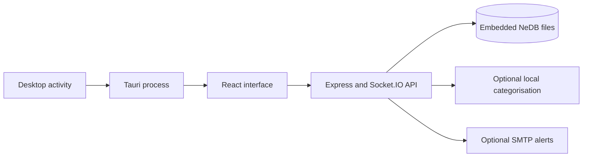

# FocusBoard

FocusBoard is a self-hosted activity tracker and focus dashboard. The desktop application can capture active-window events, while the local API stores activities, categories, goals, projects, clients, and workspace data without requiring an external database service.

## What is included

- Tauri desktop application with a React interface
- Automatic activity capture when running through Tauri
- Manual activities, categorisation rules, goals, tasks, and calendar views
- Daily, weekly, monthly, category, project, and client reports
- Workspaces, invitations, team views, integrations, webhooks, and support records
- Local JWT authentication and account settings
- Socket.IO updates and an event queue for captured activity
- Embedded NeDB-compatible datastore with configurable data and log directories
- Optional local text-classification helpers and SMTP alerts
- Prometheus-compatible API metrics

Browser development mode is useful for the dashboard, but operating-system activity tracking is available only through the Tauri application.

## Architecture


```mermaid
flowchart LR
  OS[Desktop activity] --> T[Tauri process]
  T --> UI[React interface]
  UI --> API[Express and Socket.IO API]
  API --> DB[(Embedded NeDB files)]
  API --> ML[Optional local categorisation]
  API --> MAIL[Optional SMTP alerts]
```

## Repository layout

- `FocusBoard/` — React, TypeScript, Vite, and Tauri desktop client
- `FocusBoard-backend/` — Express API, Socket.IO server, embedded datastore, scheduled jobs, and tests
- `docker-compose.yml` — backend-only container setup
- `aur/` — Arch User Repository packaging files

Component-specific notes are in [FocusBoard/README.md](FocusBoard/README.md) and [FocusBoard-backend/README.md](FocusBoard-backend/README.md).

## Requirements

- Node.js 18 or newer
- npm or Bun
- Rust and the [Tauri prerequisites](https://v2.tauri.app/start/prerequisites/) for desktop builds

## Start the backend

```bash
cd FocusBoard-backend
cp .env.example .env
npm ci
npm start
```

The API runs at `http://localhost:5000`; `GET /health` reports its basic status.

At minimum, replace `JWT_SECRET` in `.env`. Optional settings cover CORS origins, rate limits, SMTP, categorisation thresholds, data storage, logs, and the service port.

You can also run the backend container from the repository root:

```bash
cp FocusBoard-backend/.env.example .env
docker compose up --build
```

## Run the interface

```bash
cd FocusBoard
npm ci
npm run dev
```

To run as a desktop application:

```bash
cd FocusBoard
VITE_API_BASE_URL=http://localhost:5000/api npm run tauri dev
```

Useful client variables:

- `VITE_API_BASE_URL` — REST API base, normally `http://localhost:5000/api`
- `VITE_WS_URL` — optional Socket.IO endpoint override
- `VITE_FORCE_LOGIN` — set to `true` to disable session restoration during development

## Verification

Backend:

```bash
cd FocusBoard-backend
npm test
```

Frontend:

```bash
cd FocusBoard
npm test -- --run
npm run build
npm run cypress:run
```

Cypress exercises a running frontend and backend. Unit tests can run independently.

## Data and privacy

Activity and account records are written to local data files by default. `FOCUSBOARD_DATA_DIR` changes the data directory and `FOCUSBOARD_LOG_DIR` changes the log directory. Treat both as personal data: restrict file permissions, define a retention policy, and back them up only when necessary.

Automatic tracking can capture window titles and application names. Review the tracking rules and exclusions before leaving the monitor enabled, especially on shared or managed devices.

## Known limitations

- This is a self-hosted project, not a managed multi-tenant service.
- The embedded datastore is convenient for one machine but is not designed for large concurrent deployments.
- Some team, integration, support, and export screens use demonstration data or partial workflows.
- Local categorisation is a convenience feature and may classify activities incorrectly.
- SMTP, external webhooks, and Tauri packaging require environment-specific setup.
- Security and privacy controls have not been independently assessed.

## License

[MIT](FocusBoard/LICENSE)
